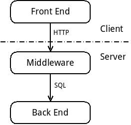

Three layers
============

Itero is a simple web application, hence its architecture is based on three
basic layers: a front end, a middleware and a back end. The front end runs on
the user's browser, the middleware and the back end run on servers (either the
same one or two dedicated machines).

Basically, the front end displays information and controllers to the user,
relaying her actions; the back end is a database that stores all the
application's data; and the middleware controls the communication between the
front end and the back end.

Front end
=========

The front end is all the user sees and interacts with: the buttons, the
widgets, the forms, the charts, as well as how all this changes in response to
the user's actions. This is the user interface of the application.

The front end implements some of the application logic. Since it runs on the
user's computer, ideally all the computation should be done on the front end,
to lessen the server's duty. But there are two limitations. First, the
communication between the front end and the middleware may be slow. Therefore,
if some computation needs large input data but produces small output data, it
is usually more efficient to perform this computation in the middleware.
Second, all the code of the front end and all the data it receives from the
middleware are available on the user's computer. That means that some malicious
user or code may use that information to abuse the application.

Since the front end runs in a browser, it consists in a collection of HTML, CSS
and JavaScript resources. Itero's front end uses [Angular](https://angular.io/)
to generate these resources. The code is written in HTML,
[SASS](https://sass-lang.com) and
[TypeScript](https://www.typescriptlang.org/). This code is compiled by
Angular into HTML, CSS and JavaScript. Angular produces a one page website:
from the browser perspective there is only one web page. This page dynamically
changes its content in response to user input and load the needed data from the
middleware by internal HTTP requests. The main advantage of Angular is to
decompose the application in strongly typed reusable components. All Itero's
front end code resides in the [app/](../app) directory.

Middleware
==========

The role of the middleware is to provide the front end resources to the user's
browser, to provide a public API for the front end and to communicate with the
back end. As explained in the previous section, the middleware also implements
the application logic that cannot be implemented in the front end, for
efficiency or security reasons.

Itero's middleware is an HTTP server. This server both provides the front end
resources (the initial and only web page) and replies to the internal HTTP
requests made by the front end (the public API). Internally, the middleware
issues SQL requests to the back end.

Itero's middleware is implemented in [Go](https://golang.org/), which provides
many advantages:
 + It is a simple, clean, easy to learn, object oriented and strongly typed
   language.
 + It makes it easy to implement safe concurrency.
 + Its standard library features packages for fast development of HTTP servers.
 + It compiles into a statically linked self-contained executable that do not
   depends on any library.

Itero's middleware code is divided into packages. Each package corresponds to a
directory at the root of the repository. See [FILES.md](../FILES.md) for details.

Back end
========

The role of the back end is to store persistent data of the application. It
usually also performs some consistency checks on that data. It typically
consists in a database inside a DBMS.

Itero's back end is a database on a [MariaDB](https://mariadb.org/) server.
MariaDB is a fork of MySQL. MariaDB has not been chosen because of its features
(it lacks some important features compared to Oracle or
[PostgreSQL](https://www.postgresql.org/)), but because it's a free software
available on most web hosting services. The files to configure the database are
in the [sql/](../sql) directory.
